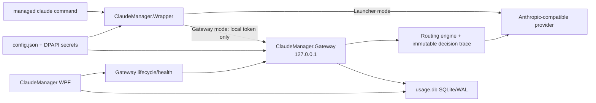

# Stage 3 architecture — Local Gateway Mode

## Decision

Claude Manager remains a modular local Windows application. Stage 3 adds one isolated process, `ClaudeManager.Gateway`, rather than hosting ASP.NET Core inside WPF. Routing logic remains pure in Core; SQLite access stays behind storage interfaces; the wrapper only manages process lifecycle and child environment.

## Load-bearing boundaries

- Launcher Mode is the schema-v3 default and preserves Stage 2 direct-provider behavior.
- Gateway binds explicitly to `127.0.0.1`, validates a DPAPI-protected local token, and strips it before upstream forwarding.
- A request may retry only before any response body byte has been written to Claude Code.
- Streaming transport forwards SSE incrementally; after the first client chunk, failures are classified and forwarded without replay.
- Live routing and route simulation call the same planner over the same immutable snapshot.
- Provider circuit, key cooldown and provider+model lockout are independent scopes.
- SQLite stores telemetry and decisions, never API keys, local auth tokens or prompt bodies by default.

## Storage decision

`ClaudeManager.Storage` uses `Microsoft.Data.Sqlite` with WAL, foreign keys, a bounded busy timeout and explicit schema versioning. Money is stored as integer micro-units to avoid floating-point drift. Connections are short-lived and non-pooled so desktop/gateway shutdown and diagnostics backup do not leave hidden Windows file handles; a serialized writer can be added behind the same interface if profiling later proves it necessary.

## Failure behavior

- Gateway startup failure leaves Launcher Mode available and produces a clear wrapper/UI error.
- A busy configured port may fall back to another loopback port recorded in state.
- Stale PID is accepted only after authenticated health fails.
- Database/telemetry failure must not expose secrets; request failure policy will be explicit rather than silently duplicating output.
